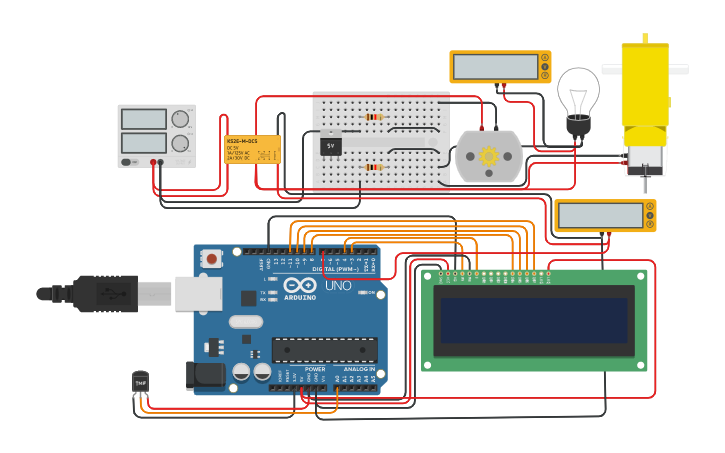

# Arduino-Based-Cooling-System

The purpose of this circuit is to detect temperature and automation of the cooling system once temperature threshold is triggered. The TMP36 serves as the electronic sensor for the temperature in Celsius. It sends data to Arduino and this board detects the temperature before sending signals to the relay once temperature limit is achieved. The relay circuit is connected to the fans (not limited to fan; you may add other coolant features such as exhaust fan or water pump).

